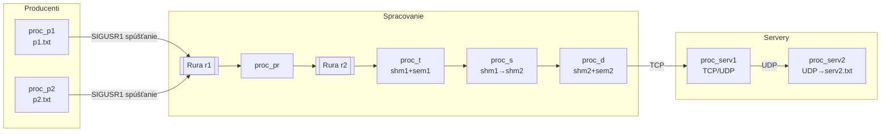

# IPC Pipeline – Dokumentácia

## Celkový prehľad
Tento projekt demonštruje viackrokový spracovateľský reťazec postavený na klasických Linux IPC primitívach (rury, zdieľaná pamäť, semafory a signály) a sieťovej komunikácii (TCP/UDP). Hlavný proces `zadanie` spúšťa sériu podprocesov, ktoré:

- čítajú vstupné slová zo súborov,
- koordinovane ich posielajú cez rury do transformátora,
- ukladajú správy do zdieľanej pamäte so semaforovou synchronizáciou,
- odosielajú správy cez TCP/UDP na serverové procesy, ktoré zapisujú výstup.

Výsledkom je pipeline, ktorá spája IPC a sieťové vrstvy a vytvára ukážku bezpečného zdieľania dát medzi procesmi.

## Začíname (Tutorial)
### Predpoklady
- Linux s podporou System V IPC a sieťových socketov.
- Kompilátor **g++** s podporou C++11.
- Nástroj **make**.

### Inštalácia a build
1. Skontrolujte zdrojové súbory v koreňovom adresári (`zadanie.cpp`, `proc_p1.cpp`, `proc_p2.cpp`, `proc_t.cpp`, `proc_d.cpp`, `proc_serv2.cpp`).
2. Spustite build:

   ```bash
   make
   ```

   Makefile vytvorí binárky `zadanie`, `proc_p1`, `proc_p2`, `proc_t`, `proc_d` a `proc_serv2`. Binarne súbory `proc_pr`, `proc_s` a `proc_serv1` sú už dodané.

3. (Voliteľné) Vyčistenie artefaktov:

   ```bash
   make clean
   ```

### Spustenie
Spustite orchestrátor s TCP a UDP portom (napr. 9000 a 9001):

```bash
./zadanie 9000 9001
```

Počas behu sa generujú súbory `*.out` a `*.err` pre každý proces (pozri `info.txt`). Proces `proc_serv2` zapisuje prijaté UDP správy do `serv2.txt`.

## Architektúra (Explanation)
### Prehľad komponentov
- **zadanie**: hlavný orchestrátor; nastaví signálnych handlerov, vytvorí rury, zdieľanú pamäť a semafory, spúšťa podprocesy a spravuje ich životný cyklus.
- **proc_p1**, **proc_p2**: čítače slov zo súborov `p1.txt` a `p2.txt`; na základe signálu `SIGUSR1` zapíšu ďalšie slovo do prvej rury.
- **proc_pr**: binárny proces (zdroj nedodaný), ktorý pravdepodobne synchronizuje producentov (`proc_p1`, `proc_p2`), číta z prvej rury a posiela výsledky do druhej rury; zároveň posiela `SIGUSR1` rodičovi na označenie dokončenia prípravy.
- **proc_t**: transformátor; číta správy z druhej rury po bajtoch, skladá ich do riadkov a zapisuje do zdieľanej pamäte `shm1` chránenou semaforom `sem1`.
- **proc_s**: binárny proces (zdroj nedodaný); pracuje so zdieľanými pamäťami `shm1` a `shm2` a semaformi `sem1`, `sem2`. Slúži ako medzičlánok medzi transformátorom a odosielateľom.
- **proc_d**: odosielateľ; číta správy zo zdieľanej pamäte `shm2` so synchronizáciou cez `sem2` a odosiela ich na TCP server na `127.0.0.1:<tcp_port>`.
- **proc_serv1**: binárny TCP/UDP server (zdroj nedodaný); očakáva pripojenie od `proc_d` na TCP a pravdepodobne forwarduje údaje cez UDP na `proc_serv2`.
- **proc_serv2**: jednoduchý UDP prijímač; ukladá prijaté správy do súboru.

### Životný cyklus orchestrátora
1. Inicializuje signálny handler pre `SIGUSR1` a počíta počet pripravených procesov (`ready_signals_count`).
2. Vytvorí dve rury: `r1` (producenti → spracovateľ) a `r2` (spracovateľ → transformátor).
3. Alokuje dve zdieľané pamäte a dvojicu semaforov pre každý kanál.
4. Spustí servery, čaká na signály pripravenosti, postupne spúšťa producentov, transformátor, odosielateľa a spracovateľa.
5. Po prijatí tretieho signálu uzatvorí rury, počká na ukončenie spracovateľa a korektne ukončí všetky procesy a IPC zdroje.

### Diagram toku dát


### IPC artefakty a inicializácia
- **Rury**: `r1` (producenti → `proc_pr`), `r2` (`proc_pr` → `proc_t`). Pri inicializácii sa vytvoria pomocou `pipe()` a deskriptory
  sa špecificky predávajú cez argv spúšťaným procesom.
- **Zdieľaná pamäť**: `shm1` (T → S), `shm2` (S → D), každá má 256 bajtov. Alokované cez `shmget(IPC_PRIVATE, 256, 0666)`.
- **Semaforové sety**: pre každý kanál dvojica `{write_lock, read_ready}` s úvodnými hodnotami `{1, 0}`. Operácie:
  - `sem_num 0`: zápisový zámok (1 = voľný, 0 = obsadený).
  - `sem_num 1`: pripravenosť na čítanie (0 = nič k dispozícii, >0 = správa čaká).

### Detailný životný cyklus orchestrátora
1. **Zachytávanie pripravenosti** – rodič inštaluje `SIGUSR1` handler a počíta doručené signály (`ready_signals_count`).
2. **Alokácia IPC** – vytvorí rury, zdieľané pamäte a semaforové sety s inicializačnými hodnotami `{1, 0}`.
3. **Spúšťanie serverov** – forkuje `proc_serv1`; po prvom `SIGUSR1` pokračuje, aby garantoval pripravenosť TCP/UDP vrstvy.
4. **Spúšťanie medzivrstiev** – spustí `proc_s` (most medzi `shm1` a `shm2`) po druhom `SIGUSR1`.
5. **Producenti a transformátor** – spustí `proc_p1`, `proc_p2`, `proc_t`, `proc_d` a `proc_serv2`. Potom spustí `proc_pr`, ktorý
   koordinuje producentov a posiela tretí `SIGUSR1` na potvrdenie, že rury sú pripravené.
6. **Uzavretie a cleanup** – po treťom `SIGUSR1` sa uzatvárajú rury, čaká sa na `proc_pr` a postupne sa terminujú podprocesy.
   Nakoniec sa uvoľnia všetky IPC zdroje cez `shmctl(..., IPC_RMID)` a `semctl(..., IPC_RMID)`.

## Príklady použitia (How-to)
### Spustenie s vlastnými vstupmi
1. Pripravte súbory s obsahom (jeden token na riadok):

   ```bash
   echo -e "alfa\nbeta\ngama" > p1.txt
   echo -e "delta\nepsilon" > p2.txt
   ```

2. Spustite orchestrátor:

   ```bash
   ./zadanie 9100 9101
   ```

3. Sledujte `serv2.txt` pre agregovaný výstup UDP servera.

### Interpretácia synchronizácie
- `proc_p1` a `proc_p2` čakajú na `SIGUSR1`; kým ho nedostanú, blokujú sa volaním `pause()`. Tento mechanizmus umožňuje riadené dávkovanie vstupov zo strany `proc_pr`.
- Semafory `sem1` a `sem2` používajú dvojprvkovú sadu `{write_lock, read_ready}`; transformátor a odosielateľ tak striedavo zapisujú/čítajú zo zdieľanej pamäti bez kolízií.

### Ladenie a sledovanie prenosu
- **Úroveň rúr**: dočasne nahraďte `proc_pr` vlastným čítačom rury a overte, že producenti posielajú dáta (`strace -e write ./proc_p1 ...`).
- **Úroveň zdieľanej pamäte**: pomocou `ipcs -m` sledujte existujúce segmenty; obsah môžete diagnosticky čítať pripojením sa cez `shmat` v malom pomocnom skripte.
- **Sieťová úroveň**: použite `nc -l 9000` alebo `socat` ako náhradu za `proc_serv1`, aby ste videli surové TCP prenosy; `tcpdump -i lo udp port <udp_port>` vám ukáže UDP výstup.
- **Logy**: všetky procesy podľa `info.txt` generujú `*.out`/`*.err`; pre súbežné ladenie je vhodné otvorenie viacerých terminálov s `tail -f`.

## Referenčný materiál (API)
### Program `zadanie`
- **Použitie:** `./zadanie <tcp_port> <udp_port>`
- **Úloha:** Spustí a zosynchronizuje celú pipeline, postará sa o uvoľnenie zdrojov a ukončenie podprocesov.

### Programy producentov `proc_p1`, `proc_p2`
- **Použitie:** `./proc_px <write_fd> <input_file>` (spúšťa ich orchestrátor).
- **Správanie:** Po prijatí `SIGUSR1` načítajú nasledujúce slovo zo súboru a zapíšu ho do rury `write_fd` zakončené znakom novej riadky.

### Program `proc_t`
- **Použitie:** `./proc_t <read_fd> <shm_id> <sem_id>`.
- **Správanie:** Číta správy po bajtoch z rury, skladá ich do riadkov a po detekcii `\n` zapisuje celý reťazec do zdieľanej pamäte chránený semaforom.

### Program `proc_d`
- **Použitie:** `./proc_d <sem_id> <shm_id> <tcp_port>`.
- **Správanie:** Čaká na semaforový signál, prečíta obsah zdieľanej pamäte a odošle ho cez TCP na lokálny server na danom porte.

### Program `proc_serv2`
- **Použitie:** `./proc_serv2 <udp_port> <output_file>`.
- **Správanie:** Viaže sa na UDP port, prijíma datagramy a appendifuje ich do súboru `output_file`.

## Detailná špecifikácia modulov
| Modul | Vstupy | Výstupy | Synchronizačné udalosti | Poznámky |
| --- | --- | --- | --- | --- |
| `zadanie` | TCP/UDP porty (argv) | spustené podprocesy, IPC ID | 3× `SIGUSR1` od podprocesov; `waitpid` na `proc_pr` | Čistí IPC aj pri zlyhaní forku/execu. |
| `proc_p1`/`proc_p2` | fd rury, cesta k `p1.txt`/`p2.txt` | slová ukončené `\n` do `r1` | `SIGUSR1` spúšťa ďalší zápis | Číta `ifstream >> word` bez prázdnych riadkov. |
| `proc_pr` | PIDy producentov, deskriptory `r1`, `r2` | koordinovaný tok `r1 → r2` | posiela `SIGUSR1` rodičovi po príprave | Binárka; predpokladané striedanie producentov. |
| `proc_t` | fd `r2`, `shm1`, `sem1` | textové správy do `shm1` | `sem0--` pred zápisom, `sem1++` po zápise | Bufferuje po bajtoch, ukončené `\n`. |
| `proc_s` | `shm1`, `sem1`, `shm2`, `sem2` | presun údajov `shm1 → shm2` | koordinácia cez oba sety semaforov | Zdroj nie je dostupný; funguje ako pipe s filtrom. |
| `proc_d` | `sem2`, `shm2`, TCP port | TCP paket na `proc_serv1` | `sem1--` na čítanie, `sem0++` po odoslaní | Udržuje trvalé TCP spojenie na loopback. |
| `proc_serv1` | TCP/UDP porty | UDP forward na `proc_serv2` | interné | Binárka; predpokladá sa bridging TCP→UDP. |
| `proc_serv2` | UDP port, `serv2.txt` | uložené datagramy | n/a | Appendifikuje s `std::endl`, zachováva poradie doručenia. |

## Algoritmy IPC a synchronizácia
### Semaforový protokol (pseudo-kód)
- **Zápis do `shm1` (proc_t)**
  1. `P(sem1.write_lock)` – čaká, kým je segment voľný.
  2. Zapíše správu (max 255 znakov + `\0`).
  3. `V(sem1.read_ready)` – signalizuje, že dáta sú pripravené.

- **Presun `shm1 → shm2` (proc_s, predpoklad)**
  1. `P(sem1.read_ready)` → čítanie z `shm1`.
  2. `P(sem2.write_lock)` → exkluzívny zápis do `shm2`.
  3. Kopíruje bajty medzi segmentmi.
  4. `V(sem1.write_lock)`, `V(sem2.read_ready)`.

- **Odosielanie (proc_d)**
  1. `P(sem2.read_ready)` → čaká na dáta.
  2. Číta obsah `shm2`, posiela cez TCP.
  3. `V(sem2.write_lock)` → uvoľní buffer pre ďalší zápis.

### Signálový handshake
1. `proc_serv1` po štarte pošle `SIGUSR1` → umožní spustenie `proc_s`.
2. `proc_s` po inicializácii pošle `SIGUSR1` → orchestrátor spustí producentov a sieťové procesy.
3. `proc_pr` po pripravení rúr pošle `SIGUSR1` → orchestrátor uzavrie nepotrebné deskriptory a sleduje dokončenie.

## Postupy riešenia problémov
- **Proces visí pri štarte**: skontrolujte, či `ready_signals_count` dosahuje 3; ak nie, spustite `ps -ef | grep proc_` a overte, ktorý proces neposlal `SIGUSR1`.
- **Nič neprichádza na `serv2.txt`**: overte, či `proc_serv1` beží a počúva na TCP porte (`ss -lntp | grep <tcp_port>`). Skúste ručne poslať správu cez `nc 127.0.0.1 <tcp_port>`.
- **IPC zdroje ostali pridelené**: po nekorektnom ukončení použite `ipcs -m` a `ipcrm -m <id>` / `ipcs -s`, `ipcrm -s <id>` na manuálne odstránenie.
- **Neblokujúce načítanie zo súboru**: ak vstupy obsahujú prázdne riadky, pridajte jednoduchý filter (napr. `grep -v '^$' p1.txt > p1.clean`).

## Ďalšie poznámky
- Súbor `info.txt` uvádza, že každý proces generuje dvojicu logov `*.out` (úspešné správy) a `*.err` (chybové správy). Zachovajte ich pri debugovaní.
- Pre korektné ukončenie sa spoliehajte na orchestrátor; pri ručnom zastavení nezabudnite zmazať zdieľané pamäte a semafory (príkaz `ipcrm`).

## Export dokumentácie do DOCX
Ak potrebujete plnoformátovú verziu dokumentácie v jednom súbore, môžete ju vygenerovať lokálne z tohto README pomocou nástroja [Pandoc](https://pandoc.org/):

```bash
pandoc README.md -o IPC_Dokumentacia.docx \
  --from markdown+smart \
  --metadata title="IPC Pipeline – Dokumentácia" \
  --toc --toc-depth=3
```

Týmto spôsobom získate DOCX s titulnou stranou (použite `--metadata` pre doplnenie autora/dátumu), obsahom, aktívnymi odkazmi a automatickým číslovaním strán bez potreby uchovávať binárny súbor v repozitári.
